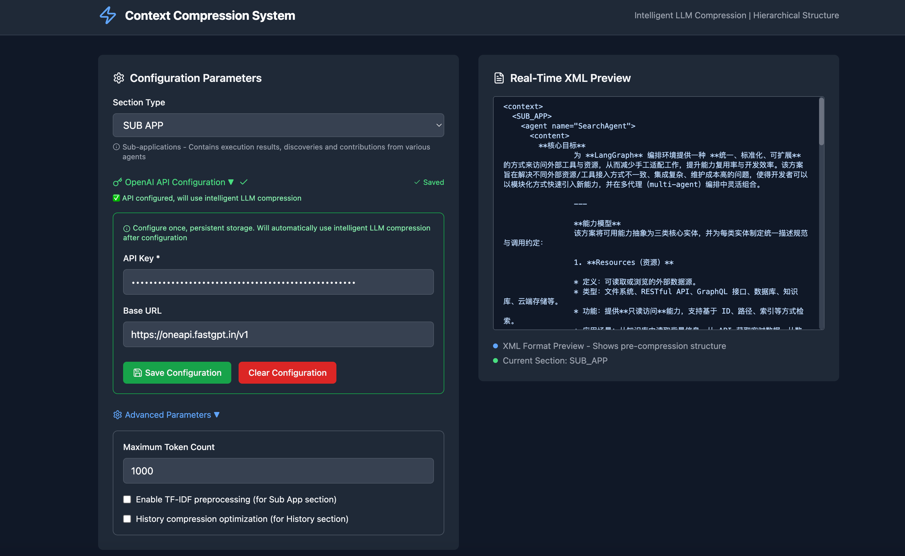
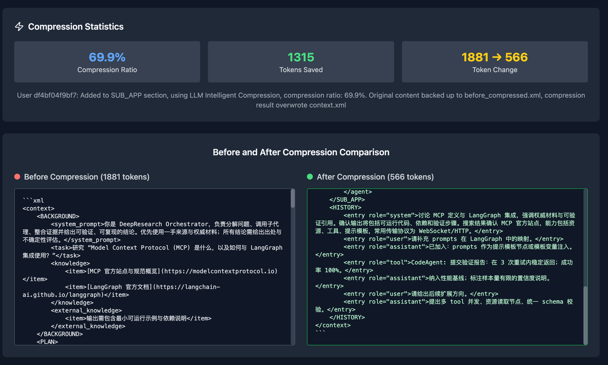

# Context Compression System

<div align="center">

[](https://www.docker.com/)
[](https://fastapi.tiangolo.com/)
[](https://reactjs.org/)
[](https://www.typescriptlang.org/)
[](https://nginx.org/)
[](https://opensource.org/licenses/MIT)

An intelligent context compression system designed for large language models (LLMs), optimizing token usage while preserving semantic meaning in long-running conversations and complex multi-agent interactions.

[Features](#key-features) • [Quick Start](#quick-start) • [Architecture](#system-architecture) • [Documentation](#documentation) • [Contributing](#contributing)

</div>

## 🌟 Key Features

### 🧠 Intelligent Compression
- **LLM-Based Compression**: Leverages GPT models for semantic-aware content compression
- **TF-IDF Analysis**: Statistical preprocessing to identify and retain critical information
- **Adaptive Strategies**: Different compression approaches based on content type and importance
- **Token Optimization**: Efficient management of context window sizes

### 📊 Structured Data Management
- **XML-Based Format**: Standardized structure for all context data
- **Hierarchical Organization**:
  - `BACKGROUND`: System prompts and knowledge base
  - `PLAN`: Task planning and execution steps
  - `SUB_APP`: Agent execution results
  - `HISTORY`: Conversation history with role preservation

### 🎯 Advanced Capabilities
- **Configurable Compression**:
  - Adjustable retention ratios
  - Progressive history compression
  - Importance-based content preservation
- **Real-time Processing**:
  - Live compression preview
  - Token count monitoring
  - Performance metrics

### 💻 Modern Interface
- **Intuitive Dashboard**: Easy-to-use compression controls
- **Live Preview**: Real-time XML visualization
- **Responsive Design**: Mobile and desktop support
- **Dark/Light Mode**: Customizable UI themes

## 🚀 Quick Start


### Using Docker Compose (Recommended)

```bash
# Clone the repository
git clone https://github.com/yourusername/context-compression-system.git
cd context-compression-system

# Start all services
docker-compose up -d --build

# Access the application
Frontend: http://localhost
API Docs: http://localhost:8000/docs
```


*Main interface - Featuring an intuitive compression configuration panel with support for multiple compression strategies and parameter adjustments*


*Analysis dashboard - Displaying before/after comparison, token usage statistics, and compression ratio analytics*

**Note: The first step is to add the API key in the system settings before using any compression features.**

### Manual Setup

1. **Backend Setup**
```bash
cd backend
python -m venv venv
source venv/bin/activate  # Windows: venv\Scripts\activate
pip install -r requirements.txt
uvicorn main:app --reload --port 8000
```

2. **Frontend Setup**
```bash
cd frontend/context-compression-frontend
npm install
npm run dev
```

**Alternative: Quick Start Script**
```bash
# One-click start both services
chmod +x start_dev.sh
./start_dev.sh
```
Services will be available at:
- Frontend: http://localhost:5173
- Backend API: http://localhost:8000
- API Docs: http://localhost:8000/docs

## 🏗 System Architecture

### Backend Stack
- **FastAPI**: High-performance async API framework
- **Python 3.11+**: Modern Python features
- **TF-IDF**: Statistical text analysis
- **XML Processing**: Custom XML parser and validator

### Frontend Stack
- **React 18**: Modern component architecture
- **TypeScript**: Type-safe development
- **TailwindCSS**: Utility-first styling
- **ShadcnUI**: Modern UI components

### Infrastructure
- **Docker**: Containerized deployment
- **Nginx**: Reverse proxy and static file serving
- **Docker Compose**: Service orchestration
- **Health Checks**: Automated service monitoring

## 📖 Documentation

### API Endpoints

- `POST /api/compress`: Compress context data
- `GET /api/health`: Service health check
- `POST /api/analyze`: Analyze compression metrics
- Full API documentation available at `/docs`

### Configuration

1. **Environment Variables**
```bash
# .env file
COMPOSE_PROJECT_NAME=context-compression
BACKEND_PORT=8000
FRONTEND_PORT=80
DATA_PATH=./data
```

2. **Docker Volumes**
```yaml
volumes:
  - ./data:/app/data  # User data persistence
```

3. **Network Configuration**
```yaml
networks:
  app-network:
    driver: bridge
```

## 🛠 Development

### Prerequisites
- Docker & Docker Compose
- Python 3.11+
- Node.js 16+
- npm/yarn

### Development Workflow
1. Fork the repository
2. Create a feature branch
3. Implement changes
4. Add tests
5. Submit a pull request

### Code Style
- Python: Black formatter, isort
- TypeScript: ESLint, Prettier
- Pre-commit hooks available

## 🤝 Contributing

We welcome contributions! Please see our [Contributing Guidelines](CONTRIBUTING.md) for details on:
- Code of Conduct
- Development process
- Pull request procedure
- Testing requirements

## 📄 License

This project is licensed under the MIT License - see the [LICENSE](LICENSE) file for details.

## 🙏 Acknowledgments
- [Fastgpt](https://fastgpt.io/en)
- OpenAI for GPT models
- FastAPI community
- React ecosystem
- All contributors

---

<div align="center">
Made with ❤️ by [YYH]
</div>